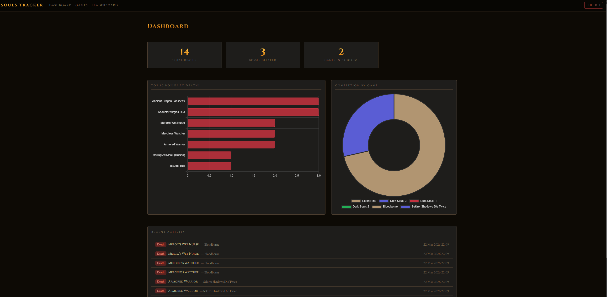

# Souls Boss Tracker

A personal full-stack web application for tracking boss attempts, deaths, and progression across FromSoftware games, including Elden Ring, Dark Souls 1/2/3, Bloodborne, and Sekiro.



## Features

- **Multi-game support**: track progress across all major FromSoftware titles, including DLC bosses and Bloodborne Chalice Dungeons
- **Boss list**: browse bosses per game with search, area filter, and cleared/remaining filter
- **Death tracking**: log deaths per boss with a running death count
- **Leaderboard**: ranked wall of shame with client-side search and filter by game and area
- **Dashboard**: global stats including total deaths, bosses cleared, games in progress, and a top-10 deaths chart
- **Export**: download the full leaderboard as a CSV

## Tech Stack

| Layer      | Technology                                |
| ---------- | ----------------------------------------- |
| Backend    | Java 17, Spring Boot 3.5, Spring Data JPA |
| Templating | Thymeleaf                                 |
| Database   | H2 (dev)                                  |
| Frontend   | Bootstrap 5, Chart.js, vanilla JS         |
| Build      | Maven                                     |

## Getting Started

### Prerequisites

- Java 17+
- Maven 3.8+

### Run locally

```bash
./mvnw spring-boot:run
```

The app starts on [http://localhost:8080](http://localhost:8080) using an in-memory H2 database. Boss data is seeded automatically from `src/main/resources/data/bosses.json` on first startup.

### Run with PostgreSQL

Set the following environment variables:

```
SPRING_DATASOURCE_URL=jdbc:postgresql://localhost:5432/souls
SPRING_DATASOURCE_USERNAME=your_user
SPRING_DATASOURCE_PASSWORD=your_password
SPRING_JPA_HIBERNATE_DDL_AUTO=update
```

## Project Structure

```
src/main/java/com/soulstracker/
├── controller/       # Spring MVC controllers
├── model/            # JPA entities (Game, Boss, BossAttempt)
├── repository/       # Spring Data JPA repositories
└── service/          # Business logic (BossService, StatsService)

src/main/resources/
├── data/bosses.json  # Seed data for all games and bosses
├── static/
│   ├── css/custom.css
│   ├── js/charts.js
│   └── images/       # Game cover images
└── templates/        # Thymeleaf HTML templates
```

## Adding Boss Images

1. Drop image files into `src/main/resources/static/images/bosses/`
2. Set `imageUrl` on the boss record — either in `bosses.json` before seeding, or via SQL:

```sql
UPDATE boss SET image_url = '/images/bosses/malenia.jpg' WHERE name = 'Malenia, Blade of Miquella';
```
